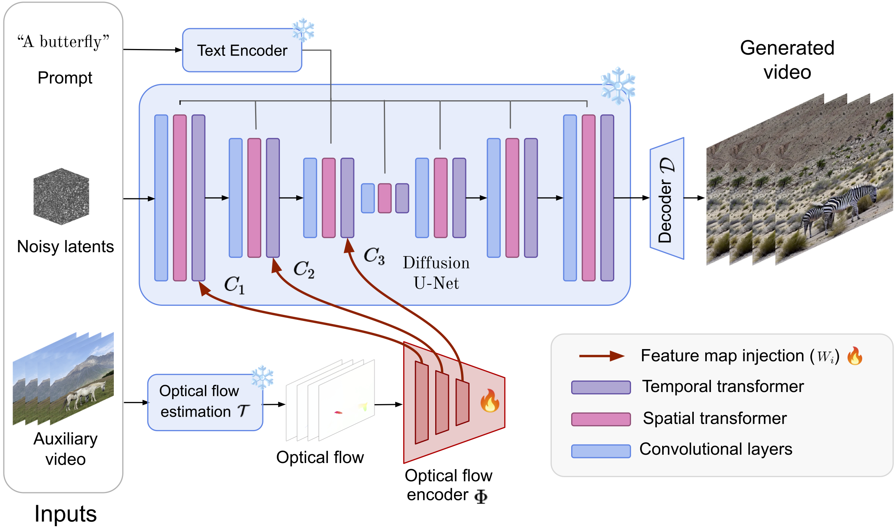
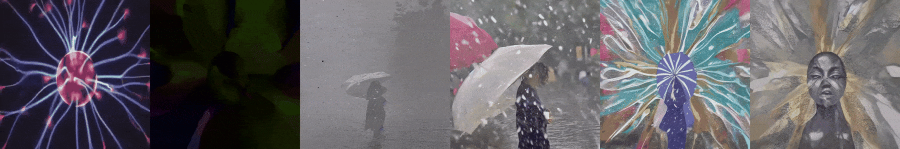
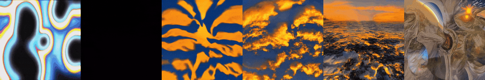

# OnlyFlow

This repository is the official implementation of [OnlyFlow](http://arxiv.org/abs/2411.10501).

This `main` branch contains the codes and model for OnlyFlow implemented on AnimateDiff v3.

> **OnlyFlow: Optical Flow based Motion Conditioning for Video Diffusion Models** <br>
> [Mathis Koroglu](https://github.com/Arlaz), [Hugo Caselles-Dupré](https://sites.google.com/view/hugo-caselles-dupre), [Guillaume Jeanneret Sanmiguel](https://guillaumejs2403.github.io/), [Matthieu Cord](https://cord.isir.upmc.fr/)<br>

## [[Paper](http://arxiv.org/abs/2411.10501)] [[Project Page](https://obvious-research.github.io/onlyflow/)] [[Weights](https://huggingface.co/obvious-research/OnlyFlow/tree/main)] [[HF Demo](https://huggingface.co/spaces/obvious-research/OnlyFlow)]



## Configurations

### Environment

* 64-bit Python 3.12 and PyTorch 2.1 or higher.
* CUDA 12.4
* Users can use the following commands to install the packages

```bash
conda env create -f envs/environment-cuda.yaml
conda activate cameractrl
```

use `environment-cpu.yaml` for CPU only.

### Dataset

- Download the [WebVideo-10M](https://github.com/m-bain/webvid) dataset
- Process it under the Indexed WebDataset format. You should have a json file describing the tar files.


## Inferences

### Prepare Models
- Download the SD1.5 base image model from [HuggingFace](https://huggingface.co/stable-diffusion-v1-5/stable-diffusion-v1-5).
- (Optional) Download a LoRA model and apply it to the base model.
- Download the checkpoints of AnimateDiff v3 (ADV3) adaptor and motion module
  from [AnimateDiff](https://github.com/guoyww/AnimateDiff).
- Download our OnlyFlow model [here](https://huggingface.co/obvious-research/onlyflow)

### Inference

We provide a custom diffusers compatible `OnlyFlowPipeline` for inference.
Exemple usage is shown in `inference/generate.py`

The diffusers pipeline has been modified using our own [Diffusers library fork](https://github.com/obvious-research/diffusers) to accomodate the following changes:
- We can generate videos longer than 16 frames using the FreeNoise method.
- The OnlyFlow pipeline (and therefore AnimateDiff pipeline) are now compatible with ip-adapter.

### Results

Here are examples of videos created by the model, with from left to right:
- input
- optical flow extracted from input
- output with onylflow influence (gamma parameter set to 0.)
- output with gamma = 0.5
- output with gamma = 0.75
- output with gamma = 1.





## Training

### Step1 (adjust the path and config)

Download the dataset as described in the [Dataset](#dataset) section.

Update the below paths to data in the config presets of `configs/presets/*/*.yaml`

```shell
dataset:
  shards: ${oc.env:PWD}/../webvid/webvid_desc.json
```

Other training parameters (lr, epochs, validation settings, etc.) are also included in the config files.
Adjust the parameters according to your needs and your hardware.

### Step2 (launch training)


Then, launch the model training using slurm integrated multiprocess launcher:

```shell
sbatch training/slurm/long-slurm/submit-a100.slurm
```

or torchrun:

```shell
sbatch training/slurm/long-slurm/submit-a100.slurm
```

Note that all our code has been tested on a single node with 8 A100 GPUs.
The scripts, their arguments and presets have been designed to work with jean zay computer's slurm scheduler and environment.

or directly using our distributed launching script and specify the distributed settings as environment variables:

```shell
./training/dist_run.sh training/train.py +presets=zay/v100-4
```

We provide our pretrained checkpoint of the OnlyFlow model
in [HuggingFace](https://huggingface.co/obvious-research/onlyflow).


## Disclaimer

This project is released for academic use. We disclaim responsibility for user-generated content. Users are solely
liable for their actions. The project contributors are not legally affiliated with, nor accountable for, users'
behaviors. Use the generative model responsibly, adhering to ethical and legal standards.

## Acknowledgement

We thank [AnimateDiff](https://github.com/guoyww/AnimateDiff) for their codes and models.
We thank [CameraCtrl](https://github.com/hehao13/CameraCtrl) for their codes and templates that we used in this project.

This project was provided with computing HPC & AI and storage resources by GENCI at IDRIS thanks to the grant 2024-AD011014329R1 on the supercomputer Jean Zay’s V100 & A100 partitions.


## BibTeX

```bibtex
@preprint{koroglu2024onlyflow,
      title={OnlyFlow: Optical Flow based Motion Conditioning for Video Diffusion Models},
      author={Mathis Koroglu and Hugo Caselles-Dupré and Guillaume Jeanneret Sanmiguel and Matthieu Cord},
      year={2024},
      eprint={2411.10501},
      archivePrefix={arXiv},
      primaryClass={cs.CV},
      url={https://arxiv.org/abs/2411.10501},
}
```
